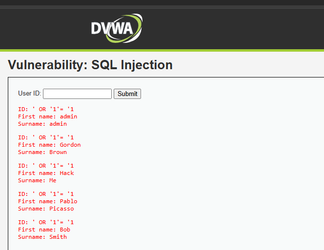

# Inyección SQL

## ¿Por qué funciona?
La vulnerabilidad ocurre cuando una aplicación incorpora directamente datos ingresados por el usuarion en una consulta SQL sin validarlos ni parametizarlos adecuadamente.

Dentro del contexto de la empresa, esta siendo una cadena de supermercados, los datos que se encontrarian en peligro de ser robados, manipulados o eliminados corresponden a:
-Datos de clientes
-Información de tarjetas de fidelización
-Inventario y precios
-Registros de ventas

## Puntaje CVSS

Debido a que corresponde a una amenaza remota que no requiere autenticación y compromete la triada completa, confidencialidad, integridad y disponibilidad, esta obtiene un puntaje bastante alto.

CVSS:3.1/AV:N/AC:L/PR:N/UI:N/S:U/C:H/I:H/A:H

### Puntaje FInal: 9.8

## Defensa

-Consultas preparadas(Prepared Statements){Técnica que separa la lógica de la consulta SQL de los datos ingresados por el usuario, evitando que estos últimos se interpreten como código ejecutable.}
-ORM seguros(Entity Framework, Hibernate){Herramientas que abstraen el acceso a la base de datos y generan consultas seguras, reduciendo el riesgo de inyección al manejar parámetros de forma controlada.}
-Validación de entradas{Proceso de verificar que los datos proporcionados por el usuario cumplen con reglas de formato, longitud y tipo antes de ser procesados.}
-Principio de mínimos privilegios en bases de datos{Configuración que otorga a cada usuario o aplicación únicamente los permisos estrictamente necesarios, limitando el impacto de un ataque exitoso.}
-Firewalls deaplicaciones web(WAF).{Sistemas que filtran y monitorean el tráfico HTTP/HTTPS, bloqueando patrones maliciosos como intentos de inyección SQL.}
-Revisiones de código y pruebas de penetración.{Evaluaciones periódicas que permiten identificar vulnerabilidades en el software antes de que sean explotadas en producción.}