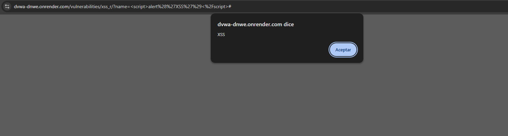

# Cross-Site Scripting (XSS)

## ¿Por qué funciona?

La vulnerabilidad ocurre cuando la aplicación muestra datos proporcionados por usuarios sin realizar procesos adecuados de sanitización o codificación.

Dentro del contexto de la empresa, esta siendo una cadena de supermercados, las acciones maliciosas que podria realizar un mal actor son:
-Robo de sesiones de clientes
-Secuestro de cuentas
-Redirección a sitios falsos de pagos
-Robo de cupones y puntos
-Suplantación de identidad

## Puntaje CVSS

La severidad suele ser menor que SQL Injection debido a que normalmente requiere interacción de la victima.

CVSS:3.1/AV:N/AC:L/PR:N/UI:R/S:C/C:H/I:L/A:N

### Puntaje Final 8.2

## Defensa

-Escapar caracteres HTML antes de mostrarlos.{Técnica que convierte caracteres especiales (ej. <, >, ") en entidades seguras para evitar que se interpreten como código.}
-Sanitización de entradas.{Limpieza de los datos ingresados por el usuario para eliminar o neutralizar contenido potencialmente peligroso.}
-Content Security Policy.{Cabecera de seguridad que restringe qué recursos (scripts, estilos, imágenes) pueden cargarse en una página, reduciendo el riesgo de ejecución de código malicioso.}
-Cookies con atributos HttpOnly y Secure.{Configuración que impide el acceso a cookies desde JavaScript y asegura su transmisión únicamente por canales cifrados (HTTPS).}
-Validación tanto en cliente como servidor.{Doble capa de control que asegura que los datos sean verificados en el navegador y nuevamente en el servidor antes de ser procesados.}
-Frameworks modernos con protección XSS integrada.{Plataformas como Angular, React o Vue que incluyen mecanismos automáticos de escape y sanitización de datos.}