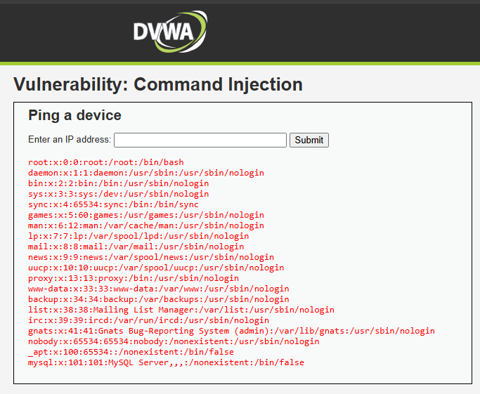

# Inyección de Comandos

## ¿Por qué funciona?

Se produce cuando una aplicación ejecuta comandos del sistema operativo utilizando entradas de usuarios sin validación adecuada.

Dentro del contexto de la empresa, esta siendo una cadena de supermercados, las acciones maliciosas que podria realizar un mal actor son:
-Acceso completo al servidor
-Robo de bases de datos de clientes
-Instalación de malware o ransomware
-Manipulación de inventarios
-Interrupción de servicios de venta online o cajas

## Puntaje CVSS

Debido a que puede conducir a ejecución remota de código(RCE) aumenta su puntaje.

CVSS:3.1/AV:N/AC:L/PR:N/UI:N/S:U/C:H/I:H/A:H

### Puntaje FInal: 9.8

## Defensa

-Evitar llamar comandos del sistema cuando exista una API equivalente.{Uso de funciones seguras provistas por el lenguaje o framework en lugar de ejecutar comandos directamente en el sistema operativo.}
-Listas blancas de entradas permitidas.{Estrategia que define explícitamente qué valores son aceptados, bloqueando cualquier entrada no contemplada.}
-Sanitización estricta de parámetros.{Limpieza y validación exhaustiva de los datos antes de pasarlos a funciones que interactúan con el sistema.}
-Ejecutar servicios con privilegios mínimos.{Configuración que limita los permisos de los procesos, reduciendo el impacto de una posible explotación.}
-Segmentación de red.{División de la infraestructura en zonas aisladas para contener un ataque y evitar su propagación.}
-Monotereo y detección de comportamientos anómalos.{Implementación de sistemas que identifican patrones sospechosos en tiempo real, como intentos de ejecución no autorizada.}
-Uso de contenedores o aislamiento de procesos.{Ejecución de aplicaciones en entornos aislados (Docker, sandboxing) para minimizar el alcance de un ataque exitoso.}